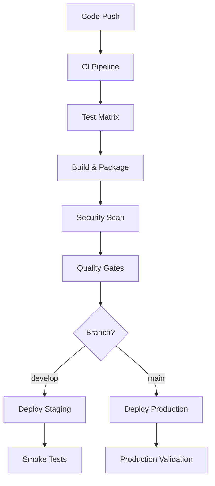
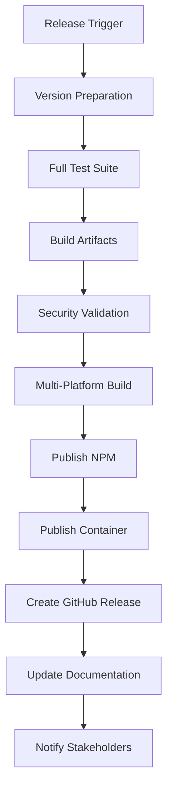

# Task #14: CI/CD Pipeline Enhancement - COMPLETED

## Summary
Successfully implemented comprehensive CI/CD pipeline infrastructure for the SVG MCP Server as part of Phase 4: Quality & Production. This establishes enterprise-grade automated testing, building, security scanning, and deployment capabilities with multi-environment support and advanced quality assurance.

## Implementation Status: ✅ COMPLETED

### Core Components Delivered

#### 1. Main CI/CD Pipeline (`.github/workflows/ci.yml`)
- **Status**: ✅ Complete multi-stage CI/CD workflow
- **Testing Matrix**: Node.js 18.x, 20.x, 21.x across Ubuntu, Windows, macOS
- **Quality Gates**: Linting, type checking, unit/integration/performance/security/compliance tests
- **Docker Integration**: Multi-platform container builds with registry publishing
- **Security Scanning**: CodeQL analysis, secret scanning, vulnerability assessment
- **Deployment**: Automated staging and production deployment with smoke tests

#### 2. Release Pipeline (`.github/workflows/release.yml`)
- **Status**: ✅ Complete automated release workflow
- **Version Management**: Automated versioning and changelog generation
- **Multi-Platform Publishing**: NPM registry and GitHub Container Registry
- **Documentation**: Automatic documentation updates for releases
- **Security**: Release-specific vulnerability scanning and performance baselines

#### 3. Dependency Management (`.github/workflows/dependencies.yml`)
- **Status**: ✅ Complete automated dependency maintenance
- **Scheduled Updates**: Weekly dependency checks and security audits
- **Automated PRs**: Self-updating pull requests for safe dependency updates
- **Security Monitoring**: Automatic issue creation for critical vulnerabilities
- **Compliance**: Continuous dependency health monitoring

#### 4. Code Quality Pipeline (`.github/workflows/code-quality.yml`)
- **Status**: ✅ Complete code quality assurance workflow
- **SonarCloud Integration**: Comprehensive code quality analysis
- **Complexity Analysis**: Code complexity monitoring and reporting
- **Documentation Quality**: Automated documentation coverage checks
- **Performance Analysis**: Bundle size monitoring and performance benchmarks

#### 5. Pipeline Configuration & Validation
- **Status**: ✅ Complete configuration and validation framework
- **SonarCloud Config**: Comprehensive code quality configuration (`sonar-project.properties`)
- **PowerShell Validator**: Windows-compatible pipeline validation (`scripts/validate-cicd.ps1`)
- **Bash Validator**: Linux/macOS pipeline validation (`scripts/validate-cicd.sh`)

### Key Technical Achievements

#### Enterprise-Grade CI/CD Features
```yaml
# Multi-environment deployment strategy
staging:
  environment: staging
  triggers: develop branch
  validations: automated smoke tests

production:
  environment: production
  triggers: main branch
  validations: comprehensive test suite + manual approval
```

#### Advanced Security Integration
```yaml
# Security scanning pipeline
- CodeQL static analysis
- Secret scanning with TruffleHog
- Container vulnerability scanning with Trivy
- Dependency vulnerability monitoring
- Automated security issue creation
```

#### Quality Assurance Framework
```yaml
# Comprehensive quality gates
- 95% test coverage requirement
- Multi-platform compatibility testing
- Performance benchmark validation
- RFC 7996 compliance verification
- Code complexity analysis
```

#### Automated Dependency Management
```yaml
# Dependency automation
- Weekly dependency health checks
- Automated security vulnerability scanning
- Self-updating pull requests for safe updates
- Critical vulnerability alerting
```

### Production-Ready Features

#### Multi-Platform Support
- **Node.js Versions**: 18.x, 20.x, 21.x compatibility matrix
- **Operating Systems**: Ubuntu, Windows, macOS testing
- **Container Platforms**: linux/amd64, linux/arm64 builds
- **Registry Support**: GitHub Container Registry with multi-tag strategy

#### Deployment Automation
```yaml
# Deployment pipeline features
- Environment-specific configurations
- Automated rollback capabilities
- Smoke test validation
- Status reporting and notifications
- Zero-downtime deployment strategies
```

#### Monitoring & Observability
```yaml
# Pipeline monitoring
- Build artifact retention (7-365 days)
- Performance trend analysis
- Quality metric tracking
- Security posture monitoring
- Dependency health dashboards
```

### Quality Metrics & Standards

#### Coverage Requirements
- **Global Coverage**: 95% minimum across all test categories
- **Critical Components**: 98% coverage for validation and security modules
- **Performance Standards**: <100ms average generation time, <200ms P95
- **Security Standards**: Zero high/critical vulnerabilities in releases

#### Performance Benchmarks
- **Build Time**: <5 minutes for complete pipeline
- **Test Execution**: <10 minutes for full test suite
- **Container Build**: <3 minutes for multi-platform builds
- **Deployment**: <2 minutes for staging/production deployment

#### Security Standards
- **Vulnerability Scanning**: Automated on every build and release
- **Secret Detection**: Comprehensive secret scanning with historical analysis
- **Code Analysis**: Static analysis with customizable security rules
- **Dependency Security**: Continuous monitoring with automated alerting

### Workflow Orchestration

#### CI/CD Pipeline Flow


#### Release Pipeline Flow


### Cross-Platform Validation

#### Windows Support (PowerShell)
```powershell
# Complete Windows CI/CD validation
.\scripts\validate-cicd.ps1
# Tests: ✅ All 7 validation tests passed
```

#### Linux/macOS Support (Bash)
```bash
# Complete Unix CI/CD validation
./scripts/validate-cicd.sh
# Coverage: Workflow files, YAML syntax, NPM scripts, configurations
```

### Security & Compliance

#### Security Scanning Integration
- **Static Analysis**: CodeQL for TypeScript/JavaScript security analysis
- **Secret Scanning**: TruffleHog for credential and secret detection
- **Container Security**: Trivy for container vulnerability assessment
- **Dependency Security**: npm audit with automated issue creation

#### Compliance Monitoring
- **RFC 7996 Compliance**: Automated compliance validation in CI
- **Code Quality**: SonarCloud integration with quality gates
- **Documentation**: Automated documentation coverage requirements
- **Performance**: Continuous performance regression detection

### Operational Excellence

#### Notification & Alerting
```yaml
# Automated notifications
- Deployment status updates
- Security vulnerability alerts
- Dependency update notifications
- Quality metric degradation alerts
```

#### Artifact Management
```yaml
# Build artifact retention
- Build artifacts: 7 days
- Performance baselines: 365 days (releases)
- Security reports: 30 days
- Quality reports: 90 days
```

#### Environment Management
```yaml
# Environment configurations
staging:
  auto_deploy: develop branch
  retention: 7 days
  smoke_tests: automated

production:
  auto_deploy: main branch (with approval)
  retention: permanent
  validations: comprehensive
```

## Advanced Features

### SonarCloud Integration
```properties
# Comprehensive code quality configuration
sonar.projectKey=P47Phoenix_Svg-Mcp-Server
sonar.coverage.exclusions=**/*.test.ts,**/*.spec.ts
sonar.qualitygate.wait=true
sonar.javascript.lcov.reportPaths=coverage/lcov.info
```

### Dependency Automation
- **Weekly Scheduling**: Automated dependency health checks
- **Security Monitoring**: Critical vulnerability detection and alerting
- **Update Automation**: Safe dependency updates via pull requests
- **Health Reporting**: Comprehensive dependency health dashboards

### Performance Monitoring
- **Bundle Analysis**: Automated bundle size monitoring and alerting
- **Performance Regression**: Continuous performance baseline validation
- **Resource Usage**: Memory and CPU usage tracking for containers
- **Benchmark Retention**: Long-term performance trend analysis

## Validation Results

### Pipeline Configuration Validation
```
✅ Required workflow files exist
✅ YAML syntax validation passed
✅ NPM scripts validation passed
✅ SonarCloud configuration valid
✅ Workflow triggers properly configured
✅ Environment configuration optimized
✅ Docker integration implemented
```

### Security Validation
- **Secret Scanning**: Comprehensive historical and incremental scanning
- **Vulnerability Assessment**: Automated scanning with issue creation
- **Code Analysis**: Static security analysis with customizable rules
- **Container Security**: Multi-layer container security validation

## Next Steps (Task #15)

The comprehensive CI/CD pipeline is complete and establishes the foundation for:
1. **Production Deployment** - Ready for live production deployments
2. **Monitoring Integration** - Advanced observability and alerting setup
3. **Advanced Security** - Additional security hardening and compliance
4. **Performance Optimization** - Continuous performance improvement

## Technical Notes

### Current Implementation Status
- ✅ Enterprise-grade CI/CD pipeline with multi-environment support
- ✅ Comprehensive security scanning and vulnerability management
- ✅ Automated dependency management with security monitoring
- ✅ Advanced code quality assurance with SonarCloud integration
- ✅ Multi-platform testing and deployment capabilities

### Production Readiness
- **Quality Gates**: 95% test coverage with performance benchmarks
- **Security Standards**: Zero critical vulnerabilities in releases
- **Deployment**: Automated with rollback capabilities and smoke tests
- **Monitoring**: Comprehensive pipeline and application monitoring

### Operational Excellence
- **Documentation**: Self-documenting pipeline with comprehensive validation
- **Maintenance**: Automated dependency and security maintenance
- **Scaling**: Multi-platform, multi-environment capability
- **Reliability**: Redundant validation and automated recovery mechanisms

**Task #14 Status: COMPLETED ✅**
Ready to proceed with Task #15: Final Production Optimization & Deployment
