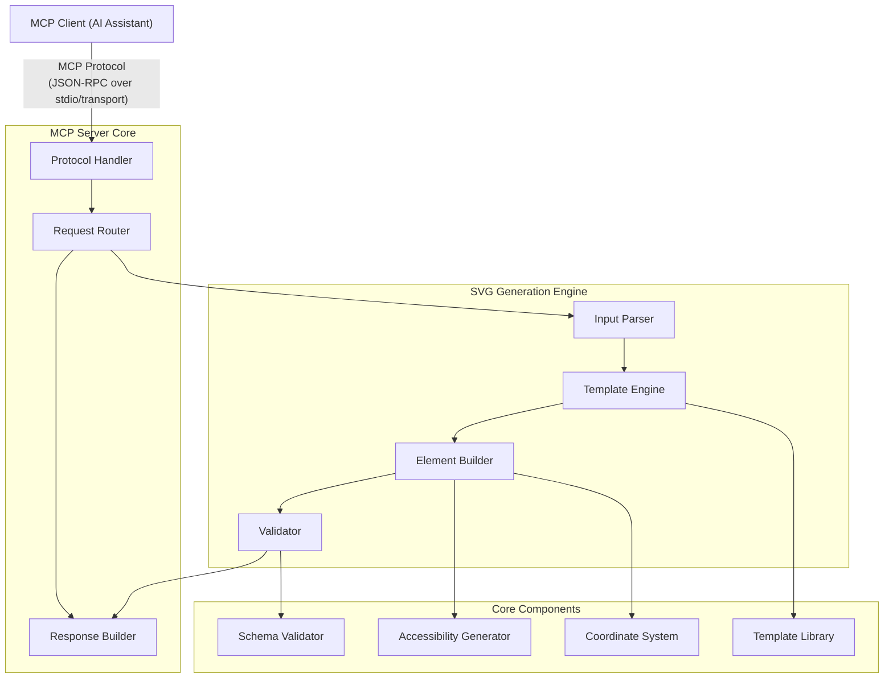
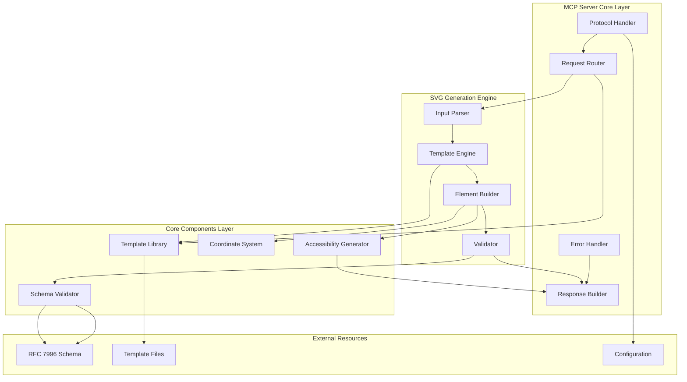
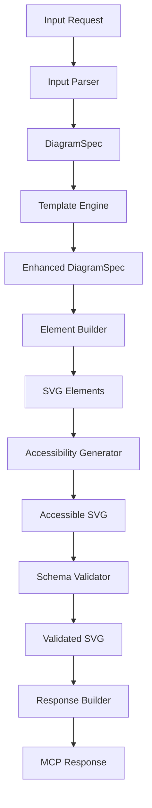
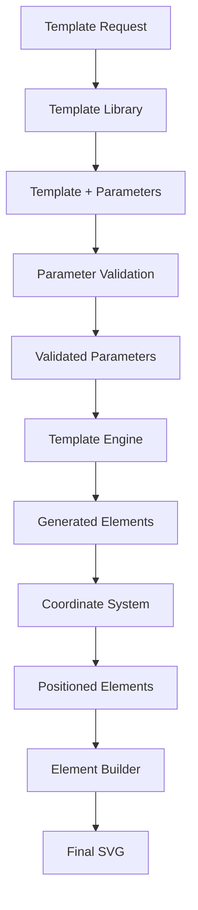
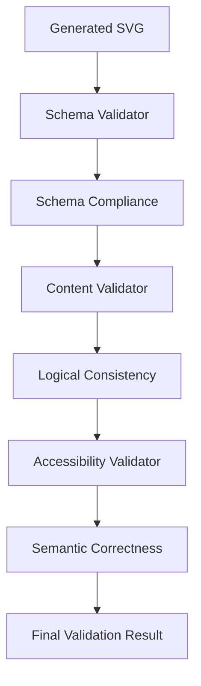
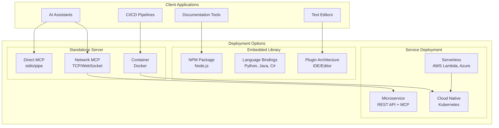
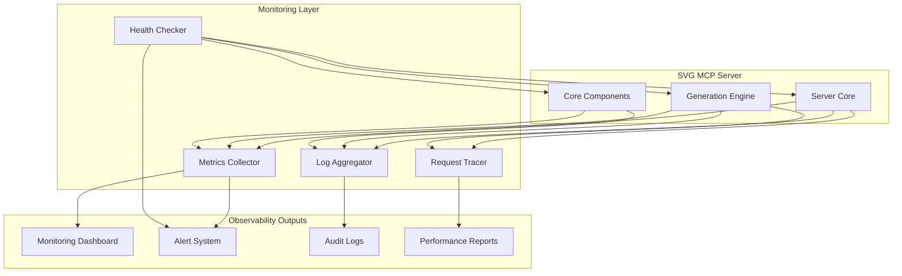

# SVG 1.2 RFC MCP Server - Architecture Document

## System Architecture Overview

The SVG 1.2 RFC MCP Server is designed as a modular, extensible system that generates RFC 7996 compliant SVG diagrams through the Model Context Protocol. Built with **TypeScript** and the **FastMCP SDK**, the architecture emphasizes validation, accessibility, and ease of use while maintaining strict compliance with the SVG 1.2 RFC specification.

## FastMCP Integration Benefits

### Rapid Development
- **Decorator-Based Tools**: Simple `@tool` decorators for SVG generation functions
- **Automatic Validation**: Built-in parameter validation using TypeScript types
- **Resource Management**: `@resource` decorators for template and schema access
- **Error Handling**: Structured error responses with automatic MCP formatting

### Protocol Abstraction
- **JSON-RPC Handling**: Automatic request/response serialization
- **Transport Agnostic**: Supports stdio, TCP, WebSocket transports
- **Capability Discovery**: Automatic tool and resource discovery
- **Progress Streaming**: Built-in support for long-running operations

### Type Safety
- **TypeScript First**: Full TypeScript support with type inference
- **Schema Validation**: Automatic parameter validation from TypeScript interfaces
- **IDE Support**: Rich IntelliSense and error checking during development

## High-Level Architecture



## Component Architecture

### Component Interaction Overview



### 1. MCP Server Core Layer

#### Protocol Handler
**Responsibility**: Manages MCP protocol communication and message handling using FastMCP SDK

**Components**:
- **FastMCP Server**: Core FastMCP server instance with automatic JSON-RPC handling
- **Tool Decorators**: FastMCP decorators for SVG generation tools
- **Resource Handlers**: FastMCP resource management for templates and schemas
- **Error Handler**: FastMCP error handling with structured error responses

**Key Interfaces**:
```typescript
import { FastMCP } from 'fastmcp';

class SvgMcpServer extends FastMCP {
  @tool("create_packet_diagram")
  async createPacketDiagram(params: PacketDiagramParams): Promise<string> {
    // SVG generation logic
  }
  
  @resource("templates")
  async getTemplates(): Promise<TemplateResource[]> {
    // Template resource logic
  }
}
```

#### Request Router
**Responsibility**: Directs SVG generation requests to appropriate processing modules using FastMCP routing

**Routing Logic**:
- **Tool Requests**: FastMCP tool decorators handle SVG generation (create_packet_diagram, create_sequence_diagram)
- **Resource Requests**: FastMCP resource decorators manage schema access and template retrieval
- **Capability Requests**: Automatic FastMCP capability discovery and configuration

#### Response Builder
**Responsibility**: Constructs properly formatted MCP responses with SVG content using FastMCP response handling

**Response Types**:
- **SVG Content**: Generated diagrams with metadata (automatically serialized by FastMCP)
- **Validation Results**: Schema compliance and error reports
- **Template Lists**: Available diagram templates and parameters
- **Error Responses**: Structured error information with FastMCP error formatting

### 2. SVG Generation Engine

#### Input Parser
**Responsibility**: Processes various input formats into standardized internal representation

**Supported Inputs**:
- **Natural Language**: Text descriptions parsed using NLP techniques
- **Structured JSON**: Schema-validated parameter objects
- **Template Requests**: Template name with parameter substitution
- **XML/SVG**: Existing SVG for validation or enhancement

**Parser Components**:
```typescript
interface InputParser {
  parseNaturalLanguage(text: string): DiagramSpec;
  parseStructuredInput(json: object): DiagramSpec;
  parseTemplateRequest(template: string, params: object): DiagramSpec;
  validateInput(spec: DiagramSpec): ValidationResult;
}
```

#### Template Engine
**Responsibility**: Manages diagram templates and parameter substitution

**Template Types**:
- **Packet Diagrams**: Network packet structure templates
- **Sequence Diagrams**: Message flow templates
- **Network Diagrams**: Topology and connection templates
- **Flow Diagrams**: Decision flow and process templates

**Template Structure**:
```typescript
interface DiagramTemplate {
  id: string;
  name: string;
  description: string;
  parameters: ParameterSchema;
  generate(params: object): SVGElements;
  validate(params: object): ValidationResult;
}
```

#### Element Builder
**Responsibility**: Constructs SVG elements according to RFC 7996 constraints

**Element Categories**:
- **Basic Shapes**: Rectangle, circle, ellipse, line, polygon
- **Text Elements**: Text, tspan, textArea with proper font handling
- **Composite Elements**: Pre-built combinations like labeled boxes
- **Accessibility Elements**: Title, desc, and semantic markup

**Builder Interface**:
```typescript
interface ElementBuilder {
  createShape(type: ShapeType, properties: ShapeProperties): SVGElement;
  createText(content: string, position: Point, style: TextStyle): SVGElement;
  createGroup(elements: SVGElement[], properties: GroupProperties): SVGElement;
  addAccessibility(element: SVGElement, accessibility: AccessibilityInfo): SVGElement;
}
```

#### Validator
**Responsibility**: Ensures all generated SVG complies with RFC 7996 specification

**Validation Levels**:
- **Schema Validation**: RELAX NG Compact schema compliance
- **Content Validation**: Logical consistency and completeness
- **Accessibility Validation**: Required semantic markup
- **Style Validation**: Color restrictions and font compliance

### 3. Core Components Layer

#### Schema Validator
**Responsibility**: Validates SVG against RFC 7996 RELAX NG schema

**Implementation**:
- **Schema Parser**: Loads and parses the RNC schema
- **Element Validator**: Validates individual SVG elements
- **Attribute Validator**: Checks attribute values and constraints
- **Structure Validator**: Validates document structure and nesting

**Validation Process**:
```typescript
interface SchemaValidator {
  loadSchema(schemaPath: string): void;
  validateDocument(svg: SVGDocument): ValidationResult;
  validateElement(element: SVGElement): ElementValidationResult;
  getSchemaInfo(): SchemaInfo;
}
```

#### Accessibility Generator
**Responsibility**: Generates accessibility metadata and semantic markup

**Features**:
- **Title Generation**: Automatic generation of element titles
- **Description Creation**: Detailed descriptions for complex elements
- **Role Assignment**: ARIA role attributes for semantic meaning
- **Reading Order**: Logical navigation sequence for screen readers

**Accessibility Types**:
```typescript
interface AccessibilityGenerator {
  generateTitle(element: SVGElement, context: DiagramContext): string;
  generateDescription(element: SVGElement, context: DiagramContext): string;
  assignRole(element: SVGElement, semanticType: SemanticType): string;
  createNavigationOrder(elements: SVGElement[]): NavigationSequence;
}
```

#### Coordinate System
**Responsibility**: Manages positioning, sizing, and layout calculations

**Features**:
- **Grid System**: Snap-to-grid alignment for consistent positioning
- **Auto-Layout**: Automatic positioning for template-based diagrams
- **Viewport Management**: Optimal viewBox calculation
- **Scaling**: Responsive sizing and proportional scaling

**Coordinate Interface**:
```typescript
interface CoordinateSystem {
  createGrid(spacing: number): Grid;
  calculateLayout(elements: DiagramElement[]): LayoutResult;
  optimizeViewport(elements: SVGElement[]): ViewportInfo;
  scaleToFit(content: SVGContent, constraints: SizeConstraints): ScaleTransform;
}
```

#### Template Library
**Responsibility**: Manages the collection of diagram templates

**Template Categories**:
- **Protocol Diagrams**: Network packet structures, protocol stacks
- **Sequence Diagrams**: Message flows, interaction patterns
- **Architecture Diagrams**: System components, data flows
- **Process Diagrams**: Flowcharts, decision trees

**Library Structure**:
```typescript
interface TemplateLibrary {
  getTemplate(id: string): DiagramTemplate;
  listTemplates(category?: string): TemplateInfo[];
  registerTemplate(template: DiagramTemplate): void;
  validateTemplate(template: DiagramTemplate): ValidationResult;
}
```

## Data Flow Architecture

### 1. Request Processing Flow



### 2. Template Processing Flow



### 3. Validation Flow



## Configuration Architecture

### Configuration Layers

#### 1. Server Configuration
- **MCP Settings**: Protocol configuration, transport options
- **Performance**: Memory limits, timeout settings, concurrency
- **Logging**: Log levels, output formats, retention policies

#### 2. Generation Settings
- **Default Styles**: Standard fonts, sizes, spacing
- **Template Settings**: Default templates, parameter validation
- **Output Options**: Format preferences, optimization settings

#### 3. Validation Configuration
- **Schema Path**: Location of RFC 7996 schema file
- **Strictness Level**: Validation rigor and error handling
- **Accessibility Requirements**: Required semantic markup levels

### Configuration Format
```json
{
  "server": {
    "name": "svg-rfc-generator",
    "version": "1.0.0",
    "transport": "stdio",
    "timeout": 30000,
    "fastmcp": {
      "autoTools": true,
      "autoResources": true,
      "errorHandling": "structured"
    }
  },
  "generation": {
    "defaultGrid": 10,
    "maxSize": {"width": 800, "height": 600},
    "defaultFont": "sans-serif",
    "strictMode": true
  },
  "validation": {
    "schemaPath": "./schemas/SVG-1.2-RFC.rnc",
    "requireAccessibility": true,
    "colorValidation": "strict"
  },
  "templates": {
    "directory": "./templates",
    "autoLoad": true,
    "validation": "strict"
  }
}
```

## Error Handling Architecture

### Error Categories

#### 1. Protocol Errors
- **Invalid MCP Request**: Malformed JSON-RPC messages
- **Unsupported Methods**: Calls to unimplemented functionality
- **Transport Errors**: Communication failures

#### 2. Input Errors
- **Invalid Parameters**: Missing or malformed input data
- **Unsupported Formats**: Unrecognized input formats
- **Constraint Violations**: Input exceeding system limits

#### 3. Generation Errors
- **Template Errors**: Template processing failures
- **Layout Errors**: Positioning and sizing failures
- **Element Creation Errors**: SVG element generation failures

#### 4. Validation Errors
- **Schema Violations**: Non-compliant SVG structure
- **Content Errors**: Logical inconsistencies
- **Accessibility Errors**: Missing semantic markup

### Error Response Format
```typescript
// FastMCP automatically handles error serialization
class SvgGenerationError extends Error {
  constructor(
    message: string,
    public code: number,
    public category: ErrorCategory,
    public details: string,
    public suggestions?: string[],
    public recoveryOptions?: RecoveryOption[]
  ) {
    super(message);
  }
}

// FastMCP will automatically convert to proper MCP error format
```

## Security Architecture

### Security Layers

#### 1. Input Sanitization
- **Parameter Validation**: Type checking and bounds validation
- **Content Filtering**: Prevention of malicious content injection
- **Resource Limits**: Prevention of resource exhaustion attacks

#### 2. Output Safety
- **SVG Sanitization**: Ensure no executable content in output
- **Schema Compliance**: Guarantee RFC 7996 conformance
- **Content Validation**: Verify logical consistency

#### 3. Process Isolation
- **Resource Containment**: Limit memory and CPU usage
- **Timeout Management**: Prevent long-running operations
- **Error Isolation**: Contain failures to individual requests

## Performance Architecture

### Performance Strategies

#### 1. Caching
- **Template Caching**: Pre-compiled template objects
- **Schema Caching**: Parsed validation schemas
- **Element Caching**: Reusable SVG components

#### 2. Optimization
- **Lazy Loading**: Load templates and schemas on demand
- **Streaming**: Generate SVG incrementally
- **Pooling**: Reuse expensive objects

#### 3. Scalability
- **Concurrent Processing**: Handle multiple requests simultaneously
- **Resource Management**: Monitor and limit resource usage
- **Graceful Degradation**: Maintain service under load

## Deployment Architecture

### Deployment Options Overview



### Deployment Options

#### 1. Standalone Server
- **Direct MCP**: FastMCP stdio/pipe communication
- **Network MCP**: FastMCP TCP/WebSocket communication  
- **Container Deployment**: Docker-based deployment with FastMCP

#### 2. Embedded Library
- **NPM Package**: Node.js library integration with FastMCP
- **Language Bindings**: Python, Java, C# bindings for FastMCP server
- **Plugin Architecture**: IDE and editor plugins using FastMCP

#### 3. Service Deployment
- **Microservice**: REST API with MCP adapter
- **Serverless**: AWS Lambda, Azure Functions
- **Cloud Native**: Kubernetes deployment

### Monitoring and Observability

#### System Monitoring Architecture



#### Metrics
- **Request Rate**: Requests per second by type
- **Response Time**: Generation time by complexity
- **Error Rate**: Failure rate by error category
- **Resource Usage**: Memory, CPU, and storage utilization

#### Logging
- **Request Logs**: Detailed request/response information
- **Error Logs**: Comprehensive error tracking
- **Performance Logs**: Timing and resource usage data
- **Audit Logs**: Security-relevant events

#### Health Checks
- **Schema Validation**: Verify schema files are accessible
- **Template Validation**: Ensure template library is functional
- **Memory Health**: Monitor memory usage patterns
- **Response Validation**: Verify output quality

This architecture provides a robust, scalable foundation for generating RFC 7996 compliant SVG diagrams while maintaining strict validation, accessibility, and security standards.
